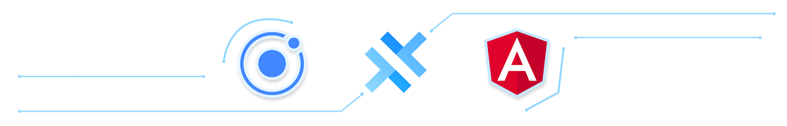
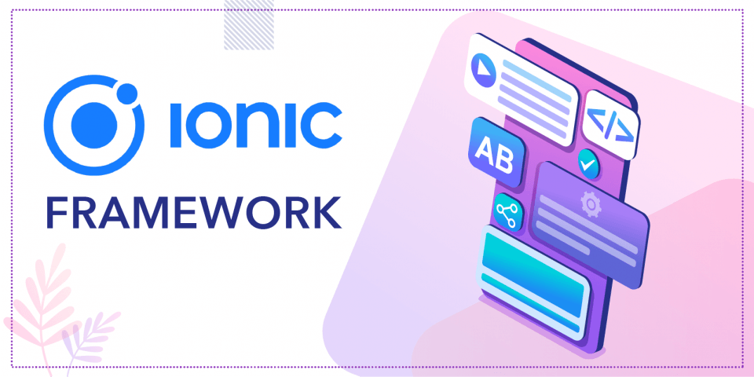
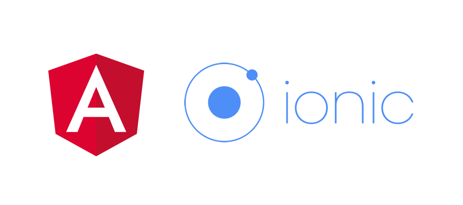

# Mobile Web Application With Ionic/Capacitor And Angular Complete Guide
##### A full guide to Build Native iOS & Android as well as Progressive Web Apps with Angular, Capacitor and the Ionic Framework (Ionic 6+).

## What is Ionic Framework

Ionic is one of the most exciting technologies you can learn at the moment - it enables you to use one codebase (written in HTML, JS and CSS) to build and ship apps as normal (progressive) web apps as well as real native mobile apps for iOS and Android. This course teaches you the latest version of Ionic from scratch with no prior knowledge about it assumed.

## What is Ionic used for?

Ionic provides a set of tools for building native iOS and Android applications, and mobile-ready Progressive Web Apps, using familiar web libraries, frameworks, and languages. Ionic Capacitor is a cross-platform native bridge that allows you to turn any web project into a native iOS or Android mobile application.

## Why Angular Framework ?

Angular (formerly Angular 2) allows you to create awesome web applications powered by TypeScript / JavaScript. Wouldn't it be great to use that Angular knowledge to build web applications that can be compiled into native mobile apps, running on any iOS or Android device? And also publish them as progressive web apps at the same time.

[⬆ back to top](#mobile-web-application-with-ionic-and-angular-complete-guide)

## Why Ionic & Angular Frameworks ?

The Ionic framework allows you to do just that! Use your existing Angular, HTML, JS and CSS knowledge and build your native mobile app with that! Ionic offers a lot of beautiful components, that can be used to compose native-like user interfaces.
Capacitor (another tool provided by the Ionic team) will handle the rest as it's used to then build a native mobile app for iOS/ Android based on your code. This allows you to focus on the things you know and release your application on all possible devices (desktop and mobile) without having to learn thousands of different languages! Indeed, with Ionic, you can use one codebase to ship three different apps (iOS, Android, web).
No wonder that hybrid frameworks like Ionic are extremely popular and in high demand!

Ionic Angular offers Angular-optimized mobile and web components for building blazing fast mobile, web, and desktop apps.

###### It's just Angular
Ionic Angular combines the core Ionic developer experience with the tooling and APIs that are tailored to Angular Developers.

###### First-class PWA
Ionic Angular components work anywhere, including iOS, Android, and PWAs. Build native apps without ever leaving the Web.

###### Build in the Browser
First-class browser development support means you can build a significant portion of your app right in Chrome, then integrate and test on mobile devices when ready.

###### Enterprise-ready
Ionic Angular is supported by a company dedicated to enterprise app dev, with supported native plugins, DevOps, expert services, and more.

[⬆ back to top](#mobile-web-application-with-ionic-and-angular-complete-guide)

## How can Ionic Framework Language help you?
- User-friendly interface and uses Angular.
- Larger community Support.
- Effortless Evaluation.
- Acts as an open-source platform.
- It's much simpler to switch between platforms.
- Streamlined costs of development.
- Ionic uses Cordova/Capacitor Plugins.

[⬆ back to top](#mobile-web-application-with-ionic-and-angular-complete-guide)

## How can Ionic Framework Language help you?
The reasons why the Ionic Framework is the best for mobile app development are:

- **It is an Independent Platform** : The best thing about ionic framework development is that the mobile app can be developed using any language and platform. Therefore, your app will work on Android, iOS, Windows, and any other web OS as well. This makes it highly demanding by app developers.
- **Single or reusable Code-base** : It allows you to quickly transform from one OS to another without much hassle or changes in the original code. The code used for one platform can be used for others as well.
- **Easy App integration** : Ionic's app connectivity is extremely efficient, making it possible to effortlessly share data and operations between a variety of business apps. Many people face difficulty regarding the integration part; however, with the ionic Framework, this trouble is discarded.
- **Default UX/UI** : Good UX/UI is a very important feature when it comes to mobile app development. This Framework is preferred by so many because it is said to have some of the top-rated UI interaction features like JS, CSS, HTML, etc.
- **Easy Testing** : Testing before the product's launch is a crucial step for mobile application development. The Ionic Framework makes this process very easy by enabling testing on desktop as well as other browsers performing stimulator testing Cordova codes for Android and iOS.

[⬆ back to top](#mobile-web-application-with-ionic-and-angular-complete-guide)

## What exactly are you going to learn then?
- How To use Angular & Ionic
- How to set up your Ionic projects
- The basics about Ionic - How navigation works, how your project is structured and you use its rich component library.
- How to use the many beautiful components Ionic ships with.
- How to use different kinds of navigation concepts: "Back"-Button-Navigation, tabs and sidemenus.
- How to show modals, alerts, toasts and many, many more useful UI components.
- How to test the app in the browser, on emulators or real devices.
- How to fetch and handle user input through inputs, textfields, dropdowns, dialogs etc.
- How to authenticate users and access web servers to store + load data.
- How to access the local device storage and native device features like the camera or geolocation.
- How to configure your app and publish it to the App Store or Google Play Store (or as a progressive web app).

[⬆ back to top](#mobile-web-application-with-ionic-and-angular-complete-guide)

## License

MIT

**Free Software, Hell Yeah!**

[//]: # (These are reference links used in the body of this note and get stripped out when the markdown processor does its job. There is no need to format nicely because it shouldn't be seen. Thanks SO - http://stackoverflow.com/questions/4823468/store-comments-in-markdown-syntax)

[dill]: <https://github.com/joemccann/dillinger>
[git-repo-url]: <https://github.com/joemccann/dillinger.git>
[john gruber]: <http://daringfireball.net>
[df1]: <http://daringfireball.net/projects/markdown/>
[markdown-it]: <https://github.com/markdown-it/markdown-it>
[Ace Editor]: <http://ace.ajax.org>
[node.js]: <http://nodejs.org>
[Twitter Bootstrap]: <http://twitter.github.com/bootstrap/>
[jQuery]: <http://jquery.com>
[@tjholowaychuk]: <http://twitter.com/tjholowaychuk>
[express]: <http://expressjs.com>
[AngularJS]: <http://angularjs.org>
[Gulp]: <http://gulpjs.com>

[BOOTSTRAP]: <https://www.npmjs.com/package/bootstrap>
[BOOTSWATCH]: <https://www.npmjs.com/package/bootswatch>
[FONT_AWESOME]: <https://www.npmjs.com/package/font-awesome>
[GSAP]: <https://www.npmjs.com/package/gsap>
[NGX_BOOTSTRAP]: <https://www.npmjs.com/package/ngx-bootstrap>
[NGX_SPINNER]: <https://www.npmjs.com/package/ngx-spinner>
[XNG_BREADCRUMB]: <https://www.npmjs.com/package/xng-breadcrumb>
[ANGULAR_NOTIFIER]: <https://www.npmjs.com/package/angular-notifier>
